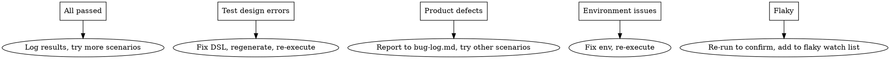

# E2E Testing Workflow for AI Web Testing Platform

## Overview

This skill guides Claude through the complete E2E testing chain of this platform: **AI Conversation → Save & Execute → Test Project → Test Cases → Test Report**, with Claude acting as a **real user** providing feedback to the AI planning agent.

## Prerequisites

Before starting, verify the environment:

```bash
# Backend: check dependencies and migrations
cd backend && uv sync && uv run alembic upgrade head

# Frontend: check dependencies
cd frontend && npm install
```

Required env vars in `backend/.env`:
- `LLM_API_KEY` — LLM provider API key for AI planning
- `LLM_BASE_URL` — LLM API endpoint
- `LLM_MODEL` — Model name (e.g. `glm-4-flash`)

## Phase 1 — Start the System

### 1.1 Start Backend

```bash
cd backend && uv run backend-dev
```

Verify: `curl http://127.0.0.1:8000/api/v1/health` returns `{"status": "ok"}`

### 1.2 Start Frontend

```bash
cd frontend && npm run dev
```

Verify: Open `http://127.0.0.1:5173` in browser

### 1.3 Prepare Target App

Prepare a **target web application** to test against. Common options:
- Local dev server of the system under test
- Public demo site (e.g. `https://the-internet.herokuapp.com`)
- The platform itself (self-testing)

Record the **base_url** — it will be needed in the AI conversation.

## Phase 2 — AI Planning Conversation

### 2.1 Enter Planning Page

1. Open `http://127.0.0.1:5173` in browser
2. Navigate to the **Planning** page (left sidebar)
3. Select a project from the project dropdown
4. A new AI planning session starts automatically

### 2.2 Act as Real User — Conversation Pattern

When testing the AI conversation flow, Claude acts as a **real QA engineer**. Follow this conversation pattern:

**First message — Describe the testing goal:**
> "我要测试 [目标系统名] 的 [功能模块]。系统地址是 [base_url]。主要业务流程是 [简述核心流程]。"

**Example:**
> "我要测试一个登录功能。系统地址是 http://the-internet.herokuapp.com。主要流程是输入用户名密码然后点击登录按钮，验证登录成功。"

**Subsequent messages — Provide details when AI asks:**

AI will collect 7 information slots through conversation:
1. **被测系统** — Target system name and URL
2. **业务目标** — What business scenario to test
3. **入口页面** — Starting page URL
4. **核心流程** — Key user workflow steps
5. **关键断言** — What to verify at each step
6. **测试数据** — Input data (usernames, passwords, etc.)
7. **范围限制** — Any constraints or exclusions

**Respond naturally** to AI questions. Do NOT dump all information at once — simulate how a real user would interact.

### 2.3 Verify AI Planning Quality

After AI generates a test plan (test scenarios), check:

| Check Point | What to Verify |
|---|---|
| Scenario completeness | Does it cover the described business flow? |
| Scenario accuracy | Are the described steps correct for the target app? |
| Missing scenarios | Are obvious edge cases missed? |
| Data requirements | Are test data needs identified? |
| Key assertions | Are verification points correct? |

### 2.4 Provide User Feedback

As a real user, provide feedback:

- **If plan is good**: Select scenarios and proceed to DSL generation
- **If plan has issues**: Point out what's wrong or missing
  > "方案遗漏了登录失败的边界场景，请补充。"
- **If AI misunderstood**: Correct the understanding
  > "不是这样的，登录页面有两个输入框和一个提交按钮，不是下拉选择。"

## Phase 3 — Generate, Save & Execute DSL

### 3.1 Generate DSL Drafts

1. After reviewing the test plan, click **"生成 DSL"** for selected scenarios
2. AI generates DSL test case drafts based on the scenario descriptions
3. Each draft contains structured steps: `goto`, `click`, `input`, `wait_for`, `assert_text`, `assert_url_contains`

### 3.2 Verify DSL Quality

Check each generated DSL draft:

| Check Point | What to Verify |
|---|---|
| Step order | Do steps follow logical business flow? |
| Locators | Are element targets reasonable? (CSS selectors, text content) |
| Actions | Are action types correct for each step? |
| Assertions | Do verification steps exist and target correct elements? |
| Base URL | Is the target URL correct? |
| Input contract | Are variable inputs properly defined? |

### 3.3 Save & Execute

1. Select satisfactory drafts
2. Click **"保存并执行"** (Save and Execute)
3. System saves DSL as test cases and triggers Playwright execution
4. **For Explorer-Judge mode**: Click **"执行并分析"** if available — runs Explorer (non-terminating) then Judge (AI analysis)

### 3.4 Monitor Execution

During execution, observe real-time progress:
- Step-by-step status updates via WebSocket
- Screenshots captured at each step
- Locator resolution traces
- Console errors and network events

If execution gets stuck or takes too long (>2 minutes), investigate.

## Phase 4 — Analyze Test Report

### 4.1 Review Execution Detail

After execution completes, review the **Execution Detail Page**:

**Left panel — Step timeline:**
- Green = passed, Red = failed, Yellow = cascade_blocked
- Click each step for details

**Center panel — Step evidence:**
- Page info (URL, title, viewport)
- Locator info (candidates, resolution strategy, failure reason)
- Screenshot evidence
- Console/network events

**Right panel — Statistics:**
- Execution overview card
- Locator strategy distribution
- Candidate element list

### 4.2 Review Verdict (Explorer-Judge mode)

If using Explorer-Judge, review the **VerdictPanel**:

| Verdict Field | What to Check |
|---|---|
| Failure classification | Is the 5-category classification correct? (test_design_error / automation_issue / product_defect / environment / suspected_flaky) |
| Root cause | Is the root cause analysis reasonable? |
| Reproduction path | Can the described steps reproduce the issue? |
| Suggested actions | Are recommendations actionable? |
| Confidence | Does the confidence level match the evidence? |

### 4.3 Judge Failure Classification Accuracy

Evaluate if the AI correctly classified failures:

- **test_design_error**: DSL has wrong selectors, missing steps, incorrect assertions
- **automation_issue**: Timing issues, locator fragility, environment mismatch
- **product_defect**: Actual bug in the target application
- **environment**: Network errors, server down, page load failures
- **suspected_flaky**: Intermittent failures without clear pattern

## Phase 5 — Iterate and Feedback

### 5.1 Based on Results, Choose Next Action



### 5.2 Provide Feedback to AI

Return to the planning conversation and share results:

> "执行完了，3个用例通过，2个失败。失败原因是 [具体原因]。请帮我调整测试方案。"

The AI should then:
- Analyze failure patterns (using execution analysis tools)
- Suggest DSL corrections
- Recommend regression scope

### 5.3 Verify AI Response to Feedback

Check that the AI agent:
- Uses `get_execution_detail` / `get_failure_analysis` tools to investigate
- Provides actionable corrections, not generic advice
- Updates test plan based on execution evidence
- Doesn't repeat the same failed approach without changes

## Phase 6 — Cross-Session Validation

### 6.1 Create New Session

1. Create a new planning session for the same project
2. Verify AI loads **cross-session insights**:
   - Previous flaky test points
   - Known failure patterns
   - Regression risk level

### 6.2 Verify Knowledge Persistence

Ask AI about previous test results:
> "上次测试有什么问题？哪些用例不稳定？"

AI should reference:
- `TestPointInsight` data (flaky scores, failure modes)
- Previous execution statistics
- Historical failure patterns

## Common Test Scenarios

### Scenario A: Login Flow
1. Describe login functionality to AI
2. Generate DSL for successful + failed login
3. Execute and verify assertions
4. Check if AI correctly identifies wrong selectors or assertion failures

### Scenario B: Form Submission
1. Describe a form (registration, search, etc.)
2. Test field validation (empty, invalid, valid input)
3. Verify AI generates separate test cases for each validation scenario

### Scenario C: Multi-Page Flow
1. Describe a flow spanning multiple pages (e.g., add to cart → checkout)
2. Verify AI generates correct page transitions (goto steps)
3. Verify locator strategies adapt to page changes

### Scenario D: Error Recovery (Explorer-Judge)
1. Execute with intentionally wrong DSL (bad selector)
2. Verify Explorer continues past failures
3. Verify Judge correctly classifies as test_design_error
4. Verify Router attempts auto-fix or reports to user

## Logging Results

After each E2E test session, append to `docs/execution-log.md`:

```markdown
## YYYY-MM-DD (E2E Manual Test)

- 任务：E2E 手动测试 — [测试目标描述]
- 操作：[测试了哪些场景，发现了什么]
- 验证：[通过/失败的具体结果]
- 发现的问题：[如有]
- 后续：[需要修复或改进的地方]
```

If defects found, also append to `docs/bug-log.md`.

## Red Flags — Stop and Report

- AI generates empty or malformed DSL
- Execution hangs for > 2 minutes without progress
- All steps fail (likely environment issue, not test quality)
- AI ignores execution results and repeats same plan
- VerdictPanel shows incorrect failure classification consistently
- Cross-session insights not loaded in new sessions

## Known Issues & Workarounds

### Windows Bash 中文编码
Windows bash 环境下，curl 传递包含中文的 JSON 会报 `error parsing body`。
**解决方法**：先将 JSON 写入文件，再用 `-d @file` 发送：
```bash
echo '{"content":"中文内容"}' > /tmp/req.json
curl -s -d @/tmp/req.json -H "Content-Type: application/json" ...
```

### LLM 响应超时
AI 规划会话首次消息可能耗时 30-120 秒（ReAct 多轮 LLM 调用）。建议 curl 设置 `--max-time 300`。

### DSL 断言能力限制
当前 DSL 不支持跨步骤变量存储/比较。对于"购物车价格与详情页一致"这类断言，需使用 `assert_text` 验证文本存在，或依赖 Explorer-Judge 模式的 AI 分析。
