# 代码库孤儿代码与架构审计

日期：2026-08-28

## 一屏结论

- 扫描了全部 275 个 tracked 文件：172 个 Python、31 个 TypeScript/TSX、61 个测试相关文件、28 个 Alembic migration、45 个 Markdown 文档。
- 当前代码结构评分：**5.8 / 10**。业务闭环完整、入口清晰，但规划域循环依赖、超大模块、多代实现并存、鉴权边界与测试门禁不一致。
- 确认 1 个完整后端孤儿模块、1 个完整前端孤儿模块，以及 15 组零调用函数、旧子系统、未用样式/依赖和临时产物。
- 不应删除 FastAPI 路由函数、SQLAlchemy 模型注册、Alembic 历史、pytest fixtures、SSE 事件类型和演示文稿资产，它们存在框架隐式引用或交付用途。
- 审计同时发现 11 个优先于清理的确定缺陷，包括明文凭据、迁移链断裂、无鉴权浏览器调试接口、VLM 排序运行时异常、`/cases/new` 路由错误和默认测试遗漏 integration。

## 扫描方法

1. 以 `git ls-files` 为全集，检查源码、测试、迁移、脚本、配置、文档和演示资产。
2. 从 Vite/FastAPI/Alembic/pytest 入口建立可达性与引用图。
3. 使用 Knip、Vulture、Pyflakes、`rg` 和逐文件复核交叉验证。
4. 对 FastAPI 装饰器、Pydantic 校验器、SQLAlchemy metadata/字符串关系、Alembic revision、pytest fixture、React lazy import、CSS class 和 CLI `__main__` 做误报排除。
5. 后端、前端、仓库资产、架构分别由独立代理扫描，候选再经独立复核。

## 关键链路

```mermaid
flowchart LR
    UI["React Router / Planning UI"] --> SSE["REST + SSE routes"]
    SSE --> Planning["Planning Service"]
    Planning --> Agent["ReAct Agent + Tools"]
    Agent --> Explorer["Playwright A11y Explorer"]
    Planning --> DSL["DSL Generator"]
    DSL --> Preflight["Locator Preflight"]
    Preflight --> Case["Persist TestCase"]
    Case --> Execution["Execution Service"]
    Execution --> Runner["Playwright Runner"]
    Runner --> Locator["Correction -> Semantic -> VLM -> Intervention"]
    Locator --> Evidence["Step Evidence / TestCaseRun"]
    Evidence --> Report["Report UI"]
    style Planning fill:#fff3e0,color:#e65100
    style Runner fill:#bbdefb,color:#0d47a1
    style Locator fill:#c8e6c9,color:#1a5e20
```



入口证据：

- 前端入口：`frontend/src/main.tsx:5-60` -> `app/App.tsx:15-22` -> `app/AppRouter.tsx:6-44`。
- 后端入口：`backend/pyproject.toml:18-19` -> `app/main.py:24-76` -> `app/api/router.py:18-31`。
- 生成链：`backend/app/services/ai_planning.py:715-900`。
- 执行链：`backend/app/services/executions.py:61-153` -> `app/runners/playwright_runner.py` -> `app/locators/fallback.py:70-171`。
- 迁移入口：`backend/alembic/env.py:10-53` 通过 `app.models` 注册 ORM metadata。

## 确认孤儿代码

以下项目没有生产运行时消费者；其中 O-06 仍被测试固定，其他项目经静态、动态加载和框架注册复核后可进入删除清单。大块删除前仍应运行完整回归。

| 编号 | 候选 | 证据 | 关键链路 |
|---|---|---|---|
| O-01 | `backend/app/runners/locator_confidence.py` 整模块 | 唯一入口 `preverify_with_vlm` 位于 14-68 行，全仓无导入/调用 | 否；DSL 同名字段仍在使用，但与该模块无关 |
| O-02 | DSL 旧适配常量 | `dsl_generator.py:102-104,118-122,163-191` 中 `_STEP_ADAPTER`、两个 contract adapter、`_STEP_MODELS`、`_CONTRACT_FIELD_ALIASES`、三个 collection/action key 常量、三个 generic 集合及本文件 `SUPPORTED_DSL_ACTIONS` 均只有定义 | 否；不要删除仍在用的 `_ACTION_ALIASES`、target/value/timeout aliases |
| O-03 | DSL 旧 helper | `dsl_generator.py:313-348,391-395` 的 `_is_price_text`、`_is_generic_product_action`、`_selector_candidates_for_step`、`_format_validation_error` 均零调用 | 否 |
| O-04 | 旧 preflight 实现 | `locator_preflight.py:199-344` 的 `preflight_locators` 仅定义，当前链使用 `apply_preflight_to_dsl` | 否 |
| O-05 | 未接入 preflight helper | `locator_preflight.py:508-566` 的 `_collect_candidates_from_matches` 零调用 | 否 |
| O-06 | 旧页面 prompt formatter/grouping 子系统 | `page_explorer.py:558-1116` 只被测试调用，生产链使用原始 `a11y_nodes` | 否；测试可能表达旧合同，删除时同步删/迁测试 |
| O-07 | 已断开的元素过滤子系统 | `page_explorer.py:1119-1217` 的 filter/keyword/strip helper 只在该孤儿子图内部互引 | 否 |
| O-08 | 页面探索零调用残留 | `page_explorer.py:260-314,728-734,1225-1288,1921-2041` 中旧 formatter、稳定度解析、元素 ID/CSS 文本提取和旧 flow action 执行链 | 否；`_collect_flow_a11y` 仍被动态导入，必须保留 |
| O-09 | 旧同步 Planning LLM | `test_planning_agent.py:1206-1237` `_call_planning_llm` 零调用，当前使用 `_stream_planning_llm` | 否 |
| O-10 | 未启用结构化日志包装 | `structured_logging.py:28-44,185-195` 的 `LogContext`、`Timer` 仅被未使用 import 引入 | 否 |
| O-11 | 零调用内部符号 | `fallback.py:298-303`、`semantic.py:621-631`、`click_preprocessor.py:79-92` | 否；cache store 还暴露出功能缺陷，见 D-06 |
| O-12 | 零调用 schema/access helper | `schemas/cases.py:45-58`、`services/ai_planning.py:2459-2471`、`api/auth.py:48-60`、`services/sse_event_log.py:67-70` | 否 |
| O-13 | 前端完整孤儿模块 | `frontend/src/layouts/AppLayout.tsx:1-5` 全仓只有定义 | 否 |
| O-14 | 前端零调用 UI/helper | `PageFeedback.tsx:11-13` 的 `EmptyBlock`；`executionPresentation.tsx:11-18,40-115` 除 `renderExecutionStatus` 外的导出 | 否 |
| O-15 | Planning 面板旧链路 | `AITestPlanningPanel.tsx:6-17,37-46,98-108,742-746` 的旧 REST imports、`buildToolMessages`、`handleImportDraft`、`draftImportLabel` | 否；面板及其他 current-* props 仍在用 |
| O-16 | 未使用 CSS | `index.css:112-128,162-171` 的 `.step-card`、`.overview-chart`、`.execution-thumbnail` | 否 |
| O-17 | 未使用依赖 | `frontend/package.json:15` 的 `echarts`；源码无 import，仅 Vite 留有分包规则 | 否 |
| O-18 | 临时 DSL 结果 | `backend/test_dsl.json` 全仓无引用，Git 历史显示为 E2E 调试输出 | 否；可改放为有测试引用的 golden fixture |
| O-19 | 冗余占位文件 | `decks/ai-web-testing-review/assets/.gitkeep`、`build/.gitkeep` 所在目录已有文件 | 否 |

## 休眠能力：不要直接删除

| 候选 | 判断 |
|---|---|
| `LocatorAttemptLog`、`AIPlanningFlowStep` | 生产无 CRUD，但已注册 ORM metadata 且已有 migration。应先决定补齐数据闭环还是按迁移流程下线表。 |
| `frontend/src/services/api.ts` 中未被 UI 调用的客户端 | 至少包括 `createCase`、`validateDslCase`、DSL generation 管理、旧 planning REST、correction 管理等。后端 API 仍存在，可能是未完成 UI；按业务域隔离后再决定删除。 |
| `rank_candidates_by_vision`、`describe_page_layout` | 无仓内生产调用但列入模块公开 API，需确认是否有仓外消费者。 |
| `hash_password`、`verify_default_postcondition`、`list_available_tools` | 仅测试调用，可能是测试钩子或预留 API；建议明确可见性，不宜机械删除。 |
| `cleanup_orphan_data.py` | 是独立运维 CLI，不依赖源码引用；但删除判定过宽，必须先修安全边界。 |
| `backend/app/ai/page_explorer.py:32-33` 旧 a11y 常量别名 | 明确兼容用途且测试引用，先设移除版本。 |

## 明确不是孤儿

- FastAPI route handler 由装饰器注册；`create_app` 由 console script/Uvicorn 字符串加载。
- Pydantic 字段/validator、SQLAlchemy 模型/relationship、Alembic `upgrade`/`downgrade`、pytest fixture 均有隐式调用。
- 28 个 migration 都属于不可随意删除的历史链；当前问题是链断裂，不是 migration “无引用”。
- `frontend/src/setupTests.ts` 由 Vite 配置加载；`types/api.ts` 中许多类型是联合类型或 API 合同组成部分。
- 7 张 deck PNG 全部被 `outline.json` 引用，且与 PPTX 内 7 张媒体一一对应。
- 根目录 `test_brand_filter_cart` 被 `backend/tests/e2e/test_e2e_brand_filter_cart.py:20-31` 读取。
- `tests/fixtures/site_server.py` 和 HTML fixture 被 intervention integration test 使用。
- `docs/superpowers`、`bug-log.md`、`execution-log.md` 是设计/审计历史；lock、Alembic 模板、`.env.example` 属构建和运行输入。

## 优先处理的确定缺陷

| 编号 | 严重度 | 问题 | 证据与处理 |
|---|---|---|---|
| D-01 | Critical | tracked 本地配置含明文 API 凭据 | `.claude/settings.local.json:28`；立即轮换凭据、停止跟踪，并按已泄露处理 Git 历史 |
| D-02 | Critical | Alembic 迁移链断裂 | `20260608_0025_sse_event_log.py:3-4` 指向不存在且被 `.gitignore:77` 忽略的 `45061d8892d7`；恢复原 revision 后做空库升级测试 |
| D-03 | High | 无鉴权 locator 调试接口可访问任意 URL 并启动浏览器 | `api/routes/ai_planning.py:497-561`；移出生产 router 或增加鉴权、URL allowlist、超时/并发限制 |
| D-04 | High | VLM candidate ranker 引用未定义 `model_family` | `locators/ai_visual.py:513-553`；补参数并从调用方传入，增加该分支测试 |
| D-05 | High | `/cases/new` 实际进入编辑页并请求 case `NaN` | `CasesPage.tsx:286-300,490-497` 与 `AppRouter.tsx:37-39`、`CaseEditPage.tsx:44-52`；增加明确新建路由/模式 |
| D-06 | High | AI selector cache 从不写入 | `fallback.py:247-303` 有读取/失效/统计，但唯一写函数零调用；接入成功定位路径或删除整套伪缓存 |
| D-07 | High | 清理脚本可能删除合法项目并级联删除用例 | `scripts/cleanup_orphan_data.py:31-39,130-136` 仅以“未关联 session”判孤儿；增加 member/case/default project 保护与确认门禁 |
| D-08 | Medium | 默认 pytest 不收集 integration | `pyproject.toml:33-38`；默认 CI 明确纳入 integration，浏览器测试再按 marker 分层 |
| D-09 | Medium | `services/dsl.py.__all__` 与真实 API 不一致 | `services/dsl.py:1099-1115` 导出不存在的 `get_dsl_generation_runtime_stats`，同时遗漏已实现的 `delete_dsl_generation_run`；修正公开符号表 |
| D-10 | Medium | 前端测试与当前 UI 漂移 | 本次 `vitest` 为 53 passed、7 failed；Cases 和 Planning 面板用例失败，并出现 render-time navigate 与 NaN height warning |
| D-11 | Medium | `.gitignore` 忽略 docs/tests/关键 migration | `.gitignore:50-79`；会静默漏提交新文档、测试和迁移，改成仅忽略生成物 |

## 架构评估

| 维度 | 分数 | 结论 |
|---|---:|---|
| 入口与主链可识别性 | 8/10 | 路由、Schema、Runner 边界总体清楚 |
| 业务闭环 | 7/10 | 规划、探索、生成、执行、证据、修正已闭环 |
| 模块内聚 | 4/10 | `test_planning_agent.py` 2651 行、`ai_planning.py` 2581 行、`page_explorer.py` 2041 行 |
| 依赖方向 | 4/10 | Planning Service、Agent、Tools 互相延迟导入并调用私有函数 |
| 前后端契约 | 6/10 | 有强类型，但由两端手工维护，存在大量未消费 API |
| 测试结构 | 5/10 | 数量充足，但目录语义混杂、默认漏跑 integration、前端现有失败 |
| 文档与配置一致性 | 3/10 | 测试数、认证、VLM 默认值、分段生成等描述与实现漂移 |

主要结构问题：

1. `services/ai_planning.py` 同时承担会话 CRUD、消息、缓存、DSL 生成、Preflight、Case 保存、执行、分析、复测和项目关联，是事实上的总编排器。
2. `services.ai_planning -> ai.test_planning_agent -> services.ai_planning`，`planning_tools` 又调用 service 私有缓存函数，延迟 import 只隐藏了循环依赖。
3. Runner 和 Execution Service 各维护同步/流式两套流程，关键状态迁移容易分叉。
4. Session 数据模型是多项目关联，但核心逻辑多处取 `project_ids[0]`，模型语义与业务语义冲突。
5. 前端 `features/`、`hooks/` 仍为空，业务集中在 1357 行面板、546 行 API client、1020 行类型文件。
6. 鉴权边界不统一：部分 API 用固定 demo user，部分执行查询没有用户依赖，前端 `/login` 直接跳转规划页。
7. `generate_segmented_case_draft` 只是单次生成函数别名，且 `flow_steps` 明确未使用，名称、文档、日志与实际行为不一致。

## 优化方向

### Phase 0：先恢复可信门禁

- 轮换泄露凭据并清理 tracked 本地配置。
- 恢复缺失 migration，增加 `alembic upgrade head` 空库 CI。
- 修复 D-03 至 D-10；CI 加 Pyflakes/Ruff、Knip、前端 build、全量测试。
- 明确鉴权策略、Session 单/多项目语义、VLM 默认值、同步/流式支持范围。

### Phase 1：低风险清理

- 删除 O-01 至 O-19 中的确定孤儿，按模块拆成小提交。
- 将休眠 API 标记 owner/status/remove-after；不能确认的先隔离，不直接删除。
- 收窄 `.gitignore`，将临时 DSL 移到 fixture 或删除。

### Phase 2：按用例拆 Planning

- 拆成 session、conversation、draft generation、save-and-execute、analysis/retest 五个 application service。
- 用 `ExplorerPort`、`DslGeneratorPort`、`CaseGateway`、`ExecutionGateway` 消除反向 import。
- 缓存和 EventLog 作为基础设施 adapter，不由 agent/tool 调 service 私有函数。

### Phase 3：统一执行核心

- Runner 只解释 DSL 并发出步骤事件。
- Execution Service 统一生命周期、事务和持久化；同步/流式仅是同一事件源的不同消费方式。
- Reporting 从持久化结果构建 read model，避免统计继续堆入 execution service。

### Phase 4：前端按业务域收口

```text
frontend/src/
  app/
  features/
    planning/
    projects/
    cases/
    executions/
    reports/
  shared/api/
  shared/ui/
```

- 拆分 `AITestPlanningPanel` 的 SSE 状态机、会话恢复、草案、执行和视图。
- `api.ts` / `types/api.ts` 按域拆分，并优先从 OpenAPI 生成 transport types。
- 抽取共享 project query/mutation，消除 Cases/Reports 重复 CRUD。

## 验证结果与限制

- `npm run build`：通过。
- `npm test -- --run`：53 passed，7 failed。
- Knip：确认 1 个未用文件、1 个未用依赖及多组未用导出。
- Vulture/Pyflakes：完成静态扫描；已排除框架型误报。
- 后端动态测试未运行：本机仅有 Python 3.9，项目要求 Python 3.12，且未安装 `uv`。
- 未执行 Alembic 动态命令，但对 28 个 revision/down_revision 全量交叉检查，确认唯一缺失父 revision 为 `45061d8892d7`。
